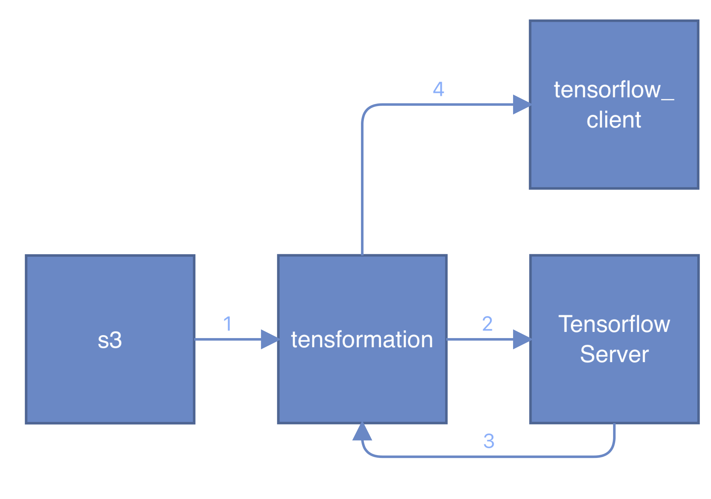

# Tensorflow-s3-docker

## Overview 



This bridge starts with an event propagated by the s3 source. 

This event is then consumed by `tensformation`, this service then performs the following actions:

* Downloads the file.
* Base64 encodes it.
* Creates a request from the `Tensorflow server`.
* Returns an event containing the Tensorflow server response. 

The found plate event is then consumed by the `tensorflow_client`, this service then performs the following actions:

* Performs the Tensorflow response analysis.
* Updates the provided Google Sheet with the found plate info.
* Returns an event back to the broker with the found plate. 

An event-display log dump of the cloudevent transactions performed in this bridge can be found in the file `ce_dump.txt`


## Deploying the bridge

1: Deploy the custom tensorflow server in the namespace.

```
kn service create tf-inference-server -n default --autoscale-window 300s \
  --request "memory=2Gi" \
  -p 8501 --image harbor-repo.vmware.com/vspheretmm/anpr-serving \
  --arg --model_config_file=/configs/models-local.config \
  --arg --monitoring_config_file=/configs/monitoring_config.txt
```

2: Update the `manifest.yaml` file, replacing the placeholder `""` marks.

3: Deploy the bridge.
```
kubectl -n default apply -f manifest.yaml
```

## Building the containers
### Building tensformation
1: Move to the tensformation directory.
```
cd tensformation
```

2: Create the go.mod file.
```
go mod init
```

3: Build & submit the dockerfile.
```
gcloud builds submit --tag gcr.io/<project>/tensformation .
```

### Building tensorflow_client
1: Move to the `tensorflow_client` directory.
```
cd tensorflow_client
```

2: Build & submit the dockerfile.
```
gcloud builds submit --tag gcr.io/<project>/tfclient .
```