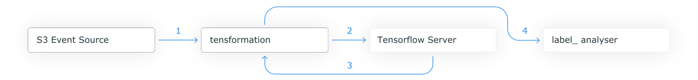

# Automatic Number Plate Recognition based on KNative

An auto-scaling ML-based number plate recognition system, running on KNative.


This repo takes the Automatic Number Plate Recognition (ANPR) TensorFlow container detailed here: <https://github.com/mylesagray/docker-tensorflow-s3>, packages the TensorFlow Python client built to interact with the model and adds a "tensformation" component to deploy an event-based auto-scaling ANPR system on KNative.

## Overview



This bridge starts with an event propagated by the s3 source.

This event is then consumed by `tensformation`, this service then performs the following actions:

* Downloads the file.
* Base64 encodes it.
* Creates a request to the `Tensorflow Server`.
* Returns an event containing the `Tensorflow Server` ANPR model's raw response.

The found plate event is then consumed by the `label_analyser`, this service then performs the following actions:

* Performs the Tensorflow response analysis on the output from the model.
* Updates the provided Google Sheet with the found plate info.
* Returns an event back to the broker with the found plate.

## Deploying the application

### Prerequisites

#### Google

You need to set up a Google Cloud Project and service user to use the Google Sheets output, please follow the following two sections of documentation:

* <https://docs.triggermesh.io/targets/googlesheets/#google-api-credentials>
* <https://docs.triggermesh.io/targets/googlesheets/#googlesheets-sheet-id>

You will need both the JSON key output and the Google Sheet ID for this app to run, additionally - don't forget to share the Google Sheet you want to use as the target for this app with the service account email address created above.

#### Amazon

You will need to create an S3 bucket with public access enabled and get its ARN (take particular note in the below docs on where and how to add your region and account ID to the ARN provided by AWS):

* <https://docs.triggermesh.io/sources/awss3/#amazon-resource-name-arn>

Additionally, you will need to create or get your AWS Access Key and Secret:

* <https://docs.aws.amazon.com/IAM/latest/UserGuide/id_credentials_access-keys.html#Using_CreateAccessKey>

#### KNative and TriggerMesh

It is required to run KNative and the TriggerMesh sources for this demo, you can find details on how to do that below:

* <https://docs.vmware.com/en/Cloud-Native-Runtimes-for-VMware-Tanzu/0.2/tanzu-cloud-native-runtimes-02/GUID-install.html>

To install the AWS Sources from TriggerMesh, run:

```sh
kubectl apply -f https://github.com/triggermesh/aws-event-sources/releases/download/v1.6.0/aws-event-sources.yaml
```

### Deploy the app

1: Update the `manifest.yaml` file, replacing the placeholder `""` marks with your information.

2: Deploy the bridge.

```sh
kubectl -n default apply -f manifest.yaml
```

## Running the app

Drop an image of a car or vehicle with a US number plate into the S3 bucket targeted in the deployment above and watch the Google Sheet as a row containing the number plate, image URL and timestamp are populated.
## Building the containers

### Building `tensformation`

1: Move to the `tensformation` directory.

```sh
cd tensformation
```

2: Create the go.mod file.

```sh
go mod init tensformation
```

3: Build & submit the dockerfile.

```sh
docker build . -t harbor-repo.vmware.com/vspheretmm/tensformation:latest -t tensformation:latest
docker push harbor-repo.vmware.com/vspheretmm/tensformation:latest

## OR

gcloud builds submit --tag gcr.io/<project>/tensformation .
```

### Building `label_analyser`

1: Move to the `label_analyser` directory.

```sh
cd label_analyser
```

2: Build & submit the dockerfile.

```sh
docker build . -t harbor-repo.vmware.com/vspheretmm/tfclient:latest -t tfclient:latest
docker push harbor-repo.vmware.com/vspheretmm/tfclient:latest

## OR

gcloud builds submit --tag gcr.io/<project>/tfclient .
```
